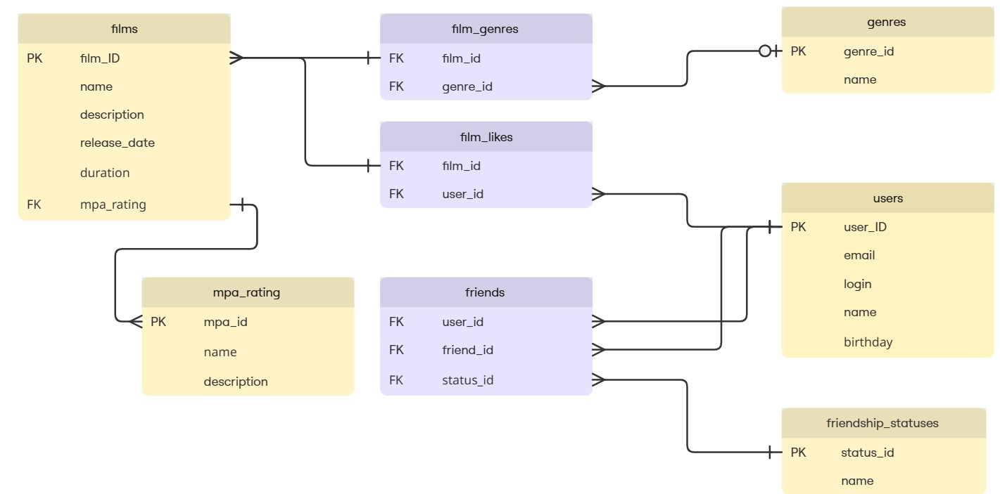

# Схема базы данных java-filmorate

##ER-диаграмма

### Описание к схеме:

Данная диаграмма представляет структуру базы данных для приложения, связанного с фильмами и пользователями.

## Таблицы

### film
Содержит данные о фильмах: название, описание, дата выпуска, продолжительность, жанры, рейтинг MPA.

### film_genre
Реализует связь многие-ко-многим между фильмами и жанрами.

### genre
Список жанров (например, "Комедия", "Драма").

### mpa_rating
Возрастные рейтинги (например, "PG-13", "R").

### user
Данные пользователей: email, логин, имя, дата рождения.

### friends
Хранит связи дружбы между пользователями и их статусы (принято/в ожидании).

### friendship_status
Справочник статусов дружбы.

### user_like
Лайки пользователей к фильмам (связь многие-ко-многим).

## Связи

- Фильмы и жанры связаны через `film_genre`.
- Фильмы имеют один рейтинг MPA (`mpa_rating`).
- Пользователи ставят лайки фильмам через `user_like`.
- Дружба между пользователями управляется через `friends` и `friendship_status`.

## Примеры SQL-запросов
- Получение топ-5 популярных фильмов с жанрами и рейтингом MPA
- Получение информации о пользователе с его друзьями и их статусом
- Добавление нового фильма с жанрами
- Обновление статуса дружбы
- Получение общих друзей для двух пользователей
- Получение всех фильмов определённого жанра